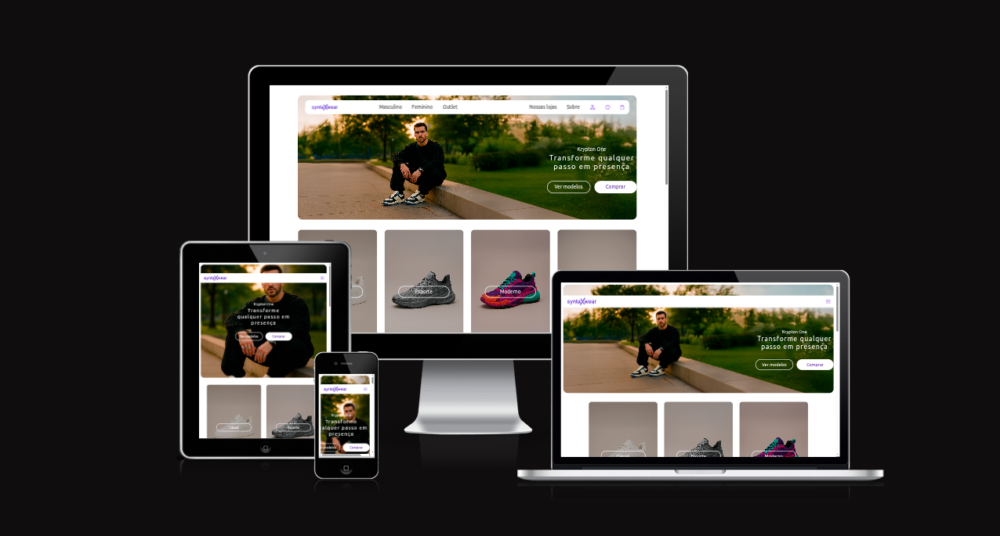

[](./images/logo/logo.svg)

# SyntaxWear - Tênis e Sneakers Online

> Este projeto foi desenvolvido como prática de exercício do curso **DevQuest** da plataforma **DevEmDobro**! O objetivo é criar uma landing page moderna e responsiva para uma loja fictícia de tênis e sneakers, utilizando apenas HTML e CSS.

---

## 📁 Estrutura do projeto

```
├── index.html
├── README.md
├── css/
│   ├── base.css
│   ├── reset.css
│   ├── variables.css
│   └── components/
│       ├── footer.css
│       ├── header.css
│       ├── hero.css
│       ├── product-category.css
│       └── product-grid.css
├── images/
│   ├── banners/
│   ├── favicons/
│   ├── icons/
│   ├── logo/
│   └── products/
```

---

## ✨ Funcionalidades

- Layout responsivo para desktop e mobile
- Seção de destaque (Hero) com chamada para ação
- Categorias de produtos com imagens temáticas
- Grid de produtos com visual moderno
- Footer com newsletter e redes sociais

---

## 🛠️ Tecnologias utilizadas

- HTML5
- CSS3
- [Ubuntu Font](https://fonts.google.com/specimen/Ubuntu)

---

## 👨‍💻 Créditos

Projeto criado como exercício prático do curso **DevQuest** - [DevEmDobro](https://devemdobro.com/).

---

## 🖼️ Imagem



---

## 📄 Licença

Este projeto é apenas para fins educacionais e não possui fins comerciais.

---

**Feito com 💜 como parte do exercício proposto pelo DevQuest | DevEmDobro**